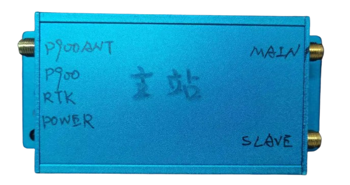
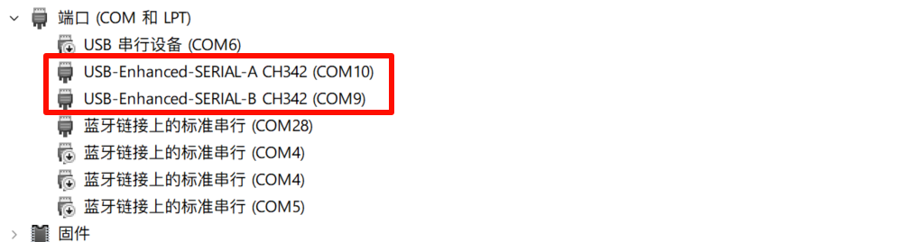
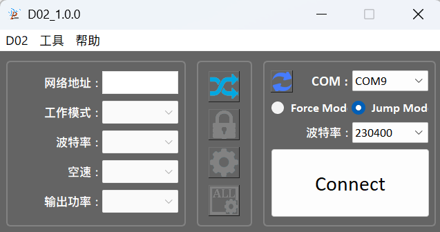
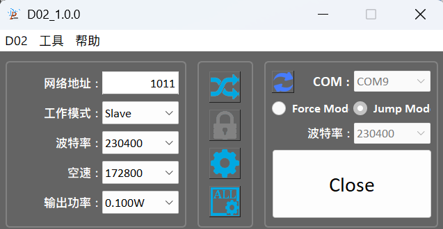

# BIT 982 定位系统说明

# 1. 系统使用教程

## 1.1 RTK系统简介

**实时动态技术**（英语：Real Time Kinematic，RTK）是**实时动态载波相位差分技术**的简称，是一种通过基准站和流动站的同步观测，利用载波相位观测值实现快速高精度定位功能的差分测量技术。

RTK系统由1个**基准站**、若干个**流动站**及**无线电通讯系统**组成。作业时，在已知高等级点上安置1台接收机作为基准站，对GPS卫星进行连续观测，并将观测数据和测站信息通过无线电传输设备实时地发送给流动站，流动站接收机在接收GPS卫星信号和采集卫星数据的同时，通过无线接收设备接收来自基准站的数据链，并在系统内对采集和接收的2组数据进行载波相位差分处理，实时解算出流动站的三维坐标及其精度。使用RTK技术利用基准站和流动站之间观测误差的空间相关性，通过差分的方式除去流动站观测数据的大部分误差，从而实现高精度定位。

> 在我们的系统中：
>
> - 基准站：主站
> - 流动站：从站
> - 无线电通讯：P900无线数传

## 1.2 系统连接



- P900 ANT：连接P900通讯天线
- MAIN 和 SLAVE：连接GPS天线

  > GPS位置：MAIN天线的位置
  >
  > GPS角度：MAIN->SLAVE构成的向量和正北方向的夹角
  >
- 指示灯

  - **电源指示灯**：绿色常亮正常
  - **RTK指示灯**

    > - 红色：无定位
    > - 橙色：Single定位
    > - 绿色：RTK  Fixed定位
    >
  - P900通讯指示灯

    > - 红色：未建立通讯
    > - 橙色：信号质量低
    > - 绿色：信号质量好
    >

- 电源：6~36V宽电压输入
- 侧面拨码开关：切换P900工作状态（CFG和DTU），详见下一小节
- 侧面TypeC接口：信号输出和配置下一小节

# 2. 首次使用及简易配置

## 2.1 TypeC串口说明

- **安装串口驱动：**

  我们板子上使用的是`CH342K`​USB转双串口芯片，需要使用厂家提供的串口驱动程序[CH343SER.EXE](assets/CH343SER-20241017123725-qtd6s15.exe)，一直NEXT安装到底即可
- **将板子通过TypeC连接到电脑**

  

  此时，会出现两个设备，其中

  - SerialA：UM982的串口
  - SerialB：P900的串口

## 2.2 P900的配置

> P900是无线数传芯片，可以在主站和从站（可以有多个）之间构建虚拟串口。

> P900配对要求：主站工作在master模式，从站工作在slave模式，需要有相同的网络地址，空速和波特率

> 关于芯片的更多资料和说明参考：http://www.isnmp.com/microhard-p900-resources/

### 2.3.1 驱动安装

P900配置程序路径：`Robot\传感器资料\P900\D02_1.0.0.exe`​

> P900配置程序实际上是对P900串口命令的封装

### 2.3.2 配置方法

- **Step1**：将开关切换到`CFG`​​模式，上电
- **Step2**：打开`D02`​​软件，`COM`​​选择`SerialB`​​对应的串口号，使用`Jump Mode`​​，波特率选择上次设定的波特率（通常为230400），点击连接

  ​​

  > P900有两种进入配置模式的方法，分别为Force mode和Jump mode
  >
  > - Force mode：将P900的Config引脚接地，然后上电，P900工作在Force mode配置模式，此时波特率固定为9600
  > - Jump mode：在P900正常上电工作后，以工作波特率发送`+++`​，跳转到配置模式，此时波特率为配置的工作波特率
  >
- **Step3**：配置

  - 从站选择Slave模式，功率0.1W
  - 主站选择Master模式，功率0.5W
  - 波特率和空速和下图保持一致

  ​
- Step4：将开关切回 `DTU`​模式

  > 由于P900只有一个串口，切换开关起到**分时复用**的功能
  >
  > - 当切到CFG时，断开和UM982的连接，建立和TypeC的连接
  > - 当切到DTU时，断开和TypeC的连接，建立和UM982的连接
  >

### 2.3.3 附录：P900的串口配置命令

```bash
## 如何进入配置模式

- **方法一**：正常工作时，用配置的工作波特率发送 ‍‍```+++\r\n‍‍```
- **方法二**：将 `CONFIG` 引脚拉低，然后上电
- **方法三**：将 `RESET` 引脚拉低，将 `CONFIG` 引脚拉低，将 `RESET` 引脚拉高

## 主站配置命令

‍‍```
AT&F7
ATS101=0
ATS102=0
ATS103=1
ATS104=20240229
ATS105=1
ATS140=65535
ATS108=20
AT&W
ATA
‍‍```

## 从站配置命令

‍‍```
AT&F8
ATS101=2
ATS102=0
ATS103=1
ATS104=20240229
ATS105=3
ATS140=1
ATS108=30
AT&W
ATA
‍‍```

%解释：
AT&FX代表恢复出厂默认配置，F7是点对多的主机，F8是点对多的从机
S101代表主从
S102设置串口波特率，0代表最大的230400
S103代表空中波特率，表示信号传输的速度
S104代表网络ID，处于同一个网络的P900之间才能组网
S105代表身份ID，每个个体在网络中拥有一个身份
S104代表该模块与谁建立通讯，65535表示广播，其他数字X代表与身份为X的模块建立通讯链
AT&W表示写入配置指令，未执行此指令，配置无效
ATA返回工作模式

%注意：串口模式发送配置命令和拉低config管脚都可以进入配置模式
```

## 2.3 UM982的配置

> UM982有三个串口，在我们的系统中，串口的定义如下
>
> - UART1：弃用
> - UART2：TypeC中的SerialA
> - UART3：接入P900

### 2.3.1 驱动安装

UM982配置程序路径：`Robot\传感器资料\UM982\UPrecise_V1.0.639.exe`​

### 2.3.2 配置

- **基站配置：基站配置时固定的**

> 在UPrecise的命令行串口中进行配置

```
freset
mode base time 60 1.5 2.5
rtcm1006 com3 10
rtcm1033 com3 10
rtcm1074 com3 1
rtcm1124 com3 1
rtcm1084 com3 1
rtcm1094 com3 1
config com3 230400
config com2 921600
gngga com1 1
gnrmc com1 1
config antenna poweron
saveconfig
```

注：换行为`\r\n`​

- **从站配置：从站配置的com2可以根据需要输入不同的内容**

```
freset
mode rover
config com3 230400
config com2 921600
gngga com2 0.05
gnrmc com2 0.05
PVTSLNA com2 0.05
KSXT com2 0.05
GPHPR com2 0.05
BESTNAVA com2 0.05
gpvtg com2 0.05
gphdt com2 0.05
gpgst com2 0.05
gngga com1 1
gnrmc com1 1
config antenna poweron
saveconfig


PVTSLNB com2 1
```

## 2.4 系统驱动

Python驱动和ROS2驱动：https://github.com/sunshineharry/UM982Driver

‍
