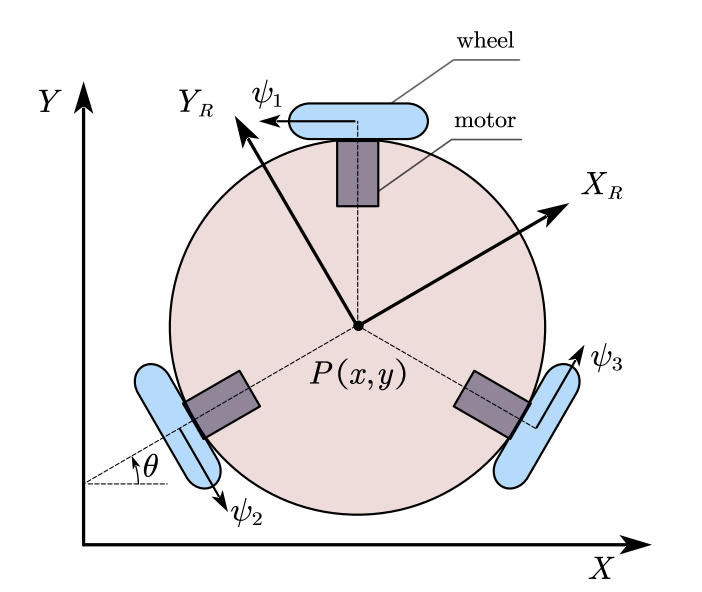

# Omni机器人数学建模



模型结构如上图所示，其中 $XY$ 坐标系是全局坐标系，$X_RY_R$ 坐标系是固定在机器人中心的局部坐标系。车轮之间的角度为 $\pi/3$。模型的质心集中在中心点 $P(x,y)$，车轮的质量集中在车轮的中心。主要参数和坐标变量如下：

- $m_1,I_1,r$：单个车轮的质量、惯性矩和半径
- $m_2,I_2,l$：质心和有效载荷（车轮除外）的质量、惯性矩和半径
- $\psi_1,\psi_2,\psi_3$：车轮的旋转角度
- $x,y,\theta$：中心体的位置和偏航角
- $r,L$：车轮和中心体的半径
- $\omega$：整体的角速度

下面采用速度分解原理，得到该模型在$X_RY_R$ 坐标系下的运动学方程：

$$
\dot\psi_1r=-(-\frac{\sqrt{3}}{2}\dot{X_R}+\frac{1}{2}\dot{Y_R}+\omega L)
$$

$$
\dot\psi_2r=-(-\dot{Y_R}+\omega L)
$$

$$
\dot\psi_3r=-(\frac{\sqrt{3}}{2}\dot{X_R}+\frac{1}{2}\dot{Y_R}+\omega L)
$$

用矩阵形式表示为：

$$
\begin{bmatrix} 
\dot\psi_{1}r \\ 
\dot\psi_{2}r \\ 
\dot\psi_{3}r
\end{bmatrix} = 
\begin{bmatrix} 
\frac{\sqrt{3}}{2} & -\frac{1}{2} & -L \\
0 & 1 & -L \\
-\frac{\sqrt{3}}{2} & -\frac{1}{2} & -L
\end{bmatrix}
\begin{bmatrix} 
\dot{X_R} \\ 
\dot{Y_R} \\ 
\omega
\end{bmatrix}
$$

下面我们考虑$X_RY_R$ 坐标系与$XY$ 坐标系之间的关系，由于偏航角为$\theta$，那么可以得到两者之间的旋转矩阵。

从$XY$ 坐标系到$X_RY_R$ 坐标系的旋转矩阵为： 

$$
R(\theta) = 
\begin{bmatrix} 
\cos\theta & -\sin\theta & 0 \\
\sin\theta & \cos\theta & 0 \\
0 & 0 & 1
\end{bmatrix}
$$

那么从$X_RY_R$ 坐标系到$XY$ 坐标系的旋转矩阵就是$R(\theta)$的逆矩阵

$$
R(\theta)^{-1} = 
\begin{bmatrix} 
\cos\theta & \sin\theta & 0 \\
-\sin\theta & \cos\theta & 0 \\
0 & 0 & 1
\end{bmatrix}
$$

所以有：

$$
\begin{bmatrix} 
\dot{X_R} \\ 
\dot{Y_R} \\ 
\omega
\end{bmatrix}
=
\begin{bmatrix} 
\cos\theta & \sin\theta & 0 \\
-\sin\theta & \cos\theta & 0 \\
0 & 0 & 1
\end{bmatrix}
\begin{bmatrix} 
\dot{X} \\ 
\dot{Y} \\ 
\dot\theta
\end{bmatrix}
$$

将这个关系式代入上面的运动学方程中，得到了在$XY$ 坐标系下的运动学方程：

$$
\begin{bmatrix} 
\dot\psi_{1}r \\ 
\dot\psi_{2}r \\ 
\dot\psi_{3}r
\end{bmatrix} = 
\begin{bmatrix} 
\frac{\sqrt{3}}{2} & -\frac{1}{2} & -L \\
0 & 1 & -L \\
-\frac{\sqrt{3}}{2} & -\frac{1}{2} & -L
\end{bmatrix}
\begin{bmatrix} 
\dot{X_R} \\ 
\dot{Y_R} \\ 
\omega
\end{bmatrix}\\=
\begin{bmatrix} 
\frac{\sqrt{3}}{2} & -\frac{1}{2} & -L \\
0 & 1 & -L \\
-\frac{\sqrt{3}}{2} & -\frac{1}{2} & -L
\end{bmatrix}
\begin{bmatrix} 
\cos\theta & \sin\theta & 0 \\
-\sin\theta & \cos\theta & 0 \\
0 & 0 & 1
\end{bmatrix}
\begin{bmatrix} 
\dot{X} \\ 
\dot{Y} \\ 
\dot\theta
\end{bmatrix}
=\begin{bmatrix} 
\sin(\theta+\frac\pi 3) & -\cos(\theta+\frac\pi 3) & -L \\
-\sin\theta & \cos\theta & -L \\
\sin(\theta-\frac\pi 3) & -\cos(\theta-\frac\pi 3) & -L
\end{bmatrix}
\begin{bmatrix} 
\dot{X} \\ 
\dot{Y} \\ 
\dot\theta
\end{bmatrix}
$$

那么我们就得到了最终的运动学方程：

$$
\dot x\sin(\theta + \pi/3) - \dot y\cos(\theta + \pi/3) - \dot \theta L - \dot \psi_{1}r = 0
$$

$$
- \dot x\sin\theta +\dot y\cos\theta- \dot \theta L - \dot \psi_{2}r = 0
$$

$$
\dot x\sin(\theta - \pi/3) -\dot y\cos(\theta - \pi/3) -\dot \theta L - \psi_{3}r = 0
$$

参考内容：

- Modeling and Tracking Control of the Omnidirectional Robot in Narrow Spaces with Uncertainty
- [浅谈三轮全向移动平台之——运动学逆解_三个全向轮的运动控制-CSDN博客](https://blog.csdn.net/weixin_41995979/article/details/81704172)

  ‍

[main.pdf](assets/main-20241228221049-7xy18zt.pdf)

在对小车的控制过程中，如果使用手柄对实物小车进行控制，那么只是在局部坐标系$X_RY_R$下进行；如果在 Vrep 中进行仿真，则是在全局坐标系$XY$下运行。所以对于上述运动学方程，要将其改写出局部坐标系$X_RY_R$与全局坐标系$XY$下的两个代码文件。

<span data-type="text" style="font-size: 22px;">1. 全局坐标系</span>$XY$<span data-type="text" style="font-size: 22px;">下的 base_controller_node</span>

文件名称：base_controller_global.py

路径：/chassis_driver/omni_chassis_driver/omni_base_controller/base_controller_global.py

首先给出正逆运动学方程：

```python
def forward(self, dpm1, dpm2, dpm3, _theta):
# 正运动学方程 将三个轮子的角速度、小车的偏航角转换为小车在全局坐标系下的线速度、角速度

        dphi = np.array([[dpm1], [dpm2], [dpm3]])

        convert_matrix_inverse = np.linalg.inv(np.array([
            [-np.sqrt(3)/2, 0.5, self.wheel_spacing],
            [0            , -1 , self.wheel_spacing],
            [ np.sqrt(3)/2, 0.5, self.wheel_spacing]
        ])* (1/self.wheel_radius))
        velocity_vector = convert_matrix_inverse @ dphi/np.pi
        vx_new, vy_new, angular_z = velocity_vector.flatten()

        # 将局部坐标系下的速度转换回全局坐标系
        linear_x = (+np.cos(_theta) * vx_new + np.sin(_theta) * vy_new)
        linear_y = (-np.sin(_theta) * vx_new + np.cos(_theta) * vy_new)

        return (linear_x, linear_y, angular_z)
```

```python
def inverse(self, linear_x, linear_y, angular_z, _theta):
# 逆运动学方程 将小车在全局坐标系下的线速度、角速度、偏航角转换为三个轮子的角速度

        # 将全局坐标系下的速度转换回局部坐标系
        vx_new = np.cos(_theta)*(linear_x) - np.sin(_theta)*(linear_y)
        vy_new = np.sin(_theta)*(linear_x) + np.cos(_theta)*(linear_y)
    
        convert_matrix = np.array([
            [-np.sqrt(3)/2, 0.5,  self.wheel_spacing],
            [0, -1,  self.wheel_spacing],
            [np.sqrt(3)/2, 0.5,  self.wheel_spacing]
        ])
        dphi = np.pi*(1/self.wheel_radius)*convert_matrix@np.array([[vx_new],[vy_new],[angular_z]])
        dpms = dphi.reshape(-1).tolist()

        return (dpms[0], dpms[1], dpms[2])
```

可以看到在上面两个函数中，都用到了偏航角 _$theta$ ，获取该参数的程序如下：

```python
# 订阅 /odom 话题信息
        self.subscription_odom = self.create_subscription(
            Odometry,
            '/odom',
            self.listener_odom,
            qos_profile_sensor_data)
    
        self._theta = 0.0  # 初始化机器人当前的偏航角（yaw）
```

```python
def listener_odom(self, msg):
        # 从消息中的四元数提取欧拉角, 这里我们只关心偏航角（yaw）
        orientation_q = msg.pose.pose.orientation
        _, _, self._theta = euler_from_quaternion(
            orientation_q.x,
            orientation_q.y,
            orientation_q.z,
            orientation_q.w
        )
```

```python
def euler_from_quaternion(x, y, z, w):
    """ 四元数转欧拉角 """
    r = math.atan2(2*(w*x + y*z), 1 - 2*(x*x + y*y))
    p = math.asin(2*(w*y - z*x))
    y = math.atan2(2*(w*z + x*y), 1 - 2*(z*z + y*y))
    return r, p, y

# 实际上，在平面中，四元数中的x、y都为0，所以上述公式也可继续简化
```

<span data-type="text" style="font-size: 22px;">2. 局部坐标系</span>$X_RY_R$<span data-type="text" style="font-size: 22px;">下的 base_controller_node</span>

文件名称：base_controller_local.py

路径：/chassis_driver/omni_chassis_driver/omni_base_controller/base_controller_local.py

只需要将偏航角 $\theta$ 固定为0，就得到了局部坐标系下的 base_controller_node
